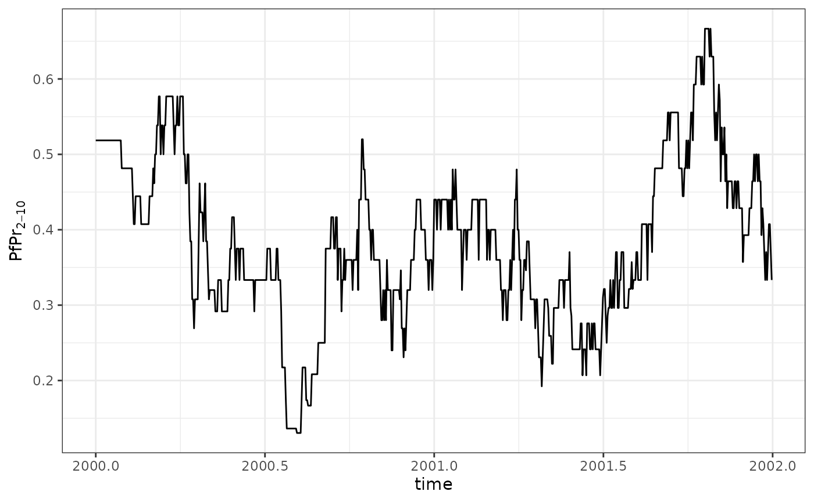
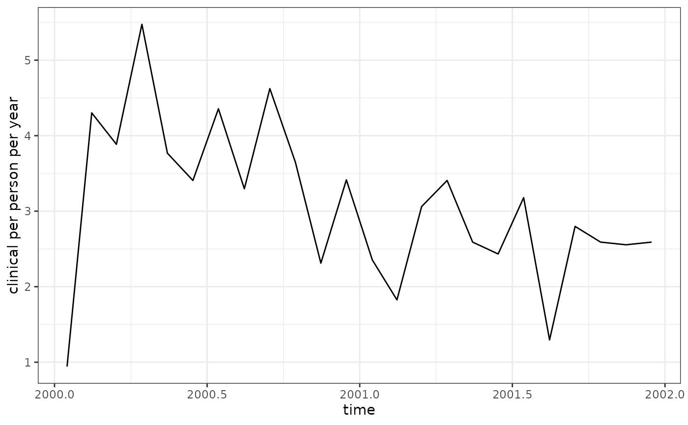

# Analysing malariasimulation output with postie

Postie provides tools to post-process output from
[malariasimulation](https://mrc-ide.github.io/malariasimulation/). This
vignette runs a short example simulation and explores how to summarise
the resulting prevalence and incidence estimates.

## Running a basic simulation

``` r

# install.packages("malariasimulation")
library(malariasimulation)
library(postie)
library(dplyr)
#> 
#> Attaching package: 'dplyr'
#> The following objects are masked from 'package:stats':
#> 
#>     filter, lag
#> The following objects are masked from 'package:base':
#> 
#>     intersect, setdiff, setequal, union
library(ggplot2)

# set up parameters
year <- 365
p <- get_parameters() |>
  set_drugs(list(AL_params)) |>
  set_clinical_treatment(1, 0.5, 0.5) |>
  set_epi_outputs(
    age_group = c(0, 5, 15, 200) * year,
    prevalence = c(2, 10) * year,
    clinical_incidence = c(0, 5, 15, 200) * year,
    severe_incidence = c(0, 5, 15, 200) * year
  )

# run for two years
sim <- run_simulation(2 * year, p)
```

The object `sim` is a data frame containing the time series of all
requested outputs. Postie converts these counts into rates that are
easier to interpret.

## Rates and prevalence

``` r

rates <- get_rates(sim)
#> Warning in get_rates(sim): required column `ft_sev` (probability
#> hospitalisation | severe case) not found, assuming ft_sev = 0.8
#> Warning: required column `ft_sev` (probability hospitalisation | severe case) not found, assuming ft_sev = 0.8
head(rates)
#> # A tibble: 6 × 18
#>    year month  week   day  time age_lower age_upper clinical severe_hospital
#>   <dbl> <int> <dbl> <dbl> <dbl>     <dbl>     <dbl>    <dbl>           <dbl>
#> 1  2000     1     1     1 2000          0      5.00        0               0
#> 2  2000     1     1     1 2000          5     15.0         0               0
#> 3  2000     1     1     1 2000         15    200.          0               0
#> 4  2000     1     1     2 2000.         0      5.00        0               0
#> 5  2000     1     1     2 2000.         5     15.0         0               0
#> 6  2000     1     1     2 2000.        15    200.          0               0
#> # ℹ 9 more variables: severe_community <dbl>, severe <dbl>,
#> #   mortality_hospital <dbl>, mortality_community <dbl>, mortality <dbl>,
#> #   yld <dbl>, yll <dbl>, dalys <dbl>, person_days <dbl>

sim <- dplyr::mutate(sim, ft_sev = 0.5)
rates <- get_rates(sim)

prev <- get_prevalence(sim)
head(prev)
#>   year month week day     time lm_prevalence_2_10
#> 1 2000     1    1   1 2000.000          0.5185185
#> 2 2000     1    1   2 2000.003          0.5185185
#> 3 2000     1    1   3 2000.005          0.5185185
#> 4 2000     1    1   4 2000.008          0.5185185
#> 5 2000     1    1   5 2000.011          0.5185185
#> 6 2000     1    1   6 2000.014          0.5185185
```

### Handling `ft_sev`

The column `ft_sev` contains the probability that a severe case leads to
hospital admission. When it is missing
[`get_rates()`](../reference/get_rates.md) assumes a value of 0.8 and
prints a warning. By supplying your own column before calling the
function you can control this assumption and remove the warning.

For the full methodology behind how postie adjusts severe incidence and
derives mortality from `ft_sev` (and the related `treatment_scaler`,
`hosp_sev_cfr` and `community_sev_cfr` arguments), see the
[`vignette("severe-mortality")`](../articles/severe-mortality.md).

The rates are per person per day. Multiplying by `365` converts them to
the more familiar per person per year units.

``` r

prev |>
  ggplot(aes(time, lm_prevalence_2_10)) +
  theme_bw() +
  geom_line() +
  labs(y = expression(PfPr[2-10]))
```



## Units and time aggregation

Rates returned by [`get_rates()`](../reference/get_rates.md) are
expressed per person per day. The unit is separate from the time
interval over which values are aggregated. You can therefore average
rates by month or year while still reporting them as cases per person
per year by multiplying by `365`.

## Aggregating over time and age

The flexibility of postie means you can aggregate outputs in many ways.
For example, to obtain annual clinical incidence and mortality by the
three age groups:

``` r

summary <- rates |>
  mutate(
    age_group = case_when(
      age_upper <= 5 ~ "U5",
      age_upper <= 15 ~ "5-15",
      TRUE ~ "15+"
    )
  ) |>
  summarise(
    clinical = weighted.mean(clinical, person_days) * 365,
    mortality = weighted.mean(mortality, person_days) * 365,
    person_days = sum(person_days),
    time = mean(time),
    .by = c(year, age_group)
  )
summary
#> # A tibble: 6 × 6
#>    year age_group clinical mortality person_days  time
#>   <dbl> <chr>        <dbl>     <dbl>       <dbl> <dbl>
#> 1  2000 U5            1.32   0.0311         8047 2000.
#> 2  2000 5-15          5.19   0.0293        12809 2000.
#> 3  2000 15+           3.50   0.0320        15644 2000.
#> 4  2001 U5            1.30   0.0159         7884 2001.
#> 5  2001 5-15          3.02   0.0197        12674 2001.
#> 6  2001 15+           2.82   0.00785       15942 2001.
```

Aggregating by both year and month can reveal seasonal patterns. The
following code collapses the daily values to monthly rates and plots the
clinical incidence over time.

``` r

monthly <- rates |>
  summarise(
    clinical = weighted.mean(clinical, person_days) * 365,
    time = mean(time),
    .by = c(year, month)
  )

monthly |>
  ggplot(aes(time, clinical)) +
  theme_bw() +
  geom_line() +
  labs(y = "clinical per person per year")
```



Postie therefore provides a straightforward pipeline from raw model
output to tidy, aggregated indicators ready for further analysis or
visualisation.
