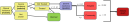

```{r, include = FALSE}
knitr::opts_chunk$set(
  collapse = TRUE,
  comment = "#>"
)
```

{width="100%"}

**A note of severity and mortality parameters and modelling:**

The parameters used here to model severe incidence and mortality are highly uncertain and will vary geographically and with time. The default parameters are fit to data and represent our best current estimates, but should be considered carefully in use.

## Severe incidence

Postie first makes an adjustment to the incidence of severe cases output from *malariasimulation*. We now assume that early treatment of clinical cases can prevent a subset of those cases from becoming severe.

We use:

-   **severe incidence** from malariasimulation ($s_{m}$)

-   the **treatment coverage**, set in *malariasimulation*, ($t_x$)

-   and the **probability a severe case does not get averted by early treatment** (\$\nu\$ default: 42% [1]).

The postie severe incidence is then calculated:

$$ s_p = s_m (1- t_x) + s_m t_x \nu $$

$\nu$ can be adjusted with the `treatment_scaler` argument in the `get_rates()` function of postie.

## Mortality

We can then calculate mortality based on:

-   the **adjusted severe incidence** ($s_p$),

-   the **probability of hospitalisation of a severe case** ($\rho$: 80% default [2])

-   the **case fatality ratio of hospitalised** **severe cases** ($\mu_H$: default = 6.5% [2-3])

-   and the **case fatality ratio of** **non-hospitalised** (**community)** **severe cases** ($\mu_C$: default = 60% [2, 4]).

$$ m_p = s_p ( \rho \mu_H + (1-\rho) \mu_C) $$

These three parameters can also be adjusted. An adjusted $\rho$ must be set as a column named `ft_sev` in the malariasimulation object, which can be varied through time, otherwise, $\rho$ = 0.8 is inferred.

```{r}
# library(postie)
# library(malariasimulation)
# 
# mal_sim_output <- malariasimulation::get_parameters() |> 
#   malariasimulation::set_drugs(drugs = list(AL_params)) |> 
#   malariasimulation::set_clinical_treatment(drug = 1, timesteps = 1, coverages = 0.5) |> 
#   malariasimulation::set_epi_outputs(clinical_incidence = c(1,100)*365, 
#                                      severe_incidence = c(1,100)*365) |> 
#   malariasimulation::run_simulation(timesteps = 1)
# 
# mal_sim_output$ft_sev <- 0.5
  
```

The severe case fatality parameters can be set directly in the `get_rates()` function where $\mu_H$ and $\mu_C$ are set with the `hosp_sev_cfr` and `community_sev_cfr` arguments, respectively.

## Adaptation from the Griffin (2016) calculations

The original Griffin-2016 calculations hard-wired the shortcut to refactor severe cases and mortality, where all malaria deaths were simply taken as 0.215 times the modelled incidence of hospital‑treated severe case. We have replaced this with an explicit two‑stream calculation that first separates severe episodes into hospital and community compartments, then applies setting‑specific case‑fatality ratios to each stream. A new column, `ft_sev`, lets users supply (and vary over time) the proportion of severe cases that reach hospital. A warning‑backed default of 0.8 preserves backward compatibility - when this default is used the original 0.215 (based on the default parameterisation) deaths‑to‑hospitalised‑cases ratio is recovered.

### Derivation of the 80% hospitalisation for reference

Let:

-   $\mu_H$ = severe case fatality hospital: 0.065

-   $\mu_C$ = severe case fatality community: 0.6

-   $\lambda_H$ = severe incidence hospital

-   $\lambda_C$ = severe incidence community

-   $\nu_D$ = scaling factor linking hospitalised severe incidence to total malaria deaths: 0.215

Total deaths (predicted two ways) are:

$$ \mu_H \lambda_H + \mu_C \lambda_C = \nu_D \lambda_H $$ Solving for the ratio of non‑hospitalised to hospitalised severe cases gives: image

$$ \lambda_C = \frac{\nu_D - \mu_H}{\mu_C}\lambda_H $$

Coverage ($\rho$): the share of severe episodes treated in hospital, is therefore: image

$$ \rho = \frac{\lambda_H}{\lambda_H + \lambda_C} = \frac{\mu_C}{\mu_C + \nu_D - \mu_H} = \frac{0.6}{0.6 + 0.215 - 0.065} $$

Which = 80%.

## References

1.  Mousa, A, A Al-Taiar, NM Anstey, C Badaut, BE Barber, Q Bassat, J Challenger, et al. ‘The Impact of Delayed Treatment of Uncomplicated P. Falciparum Malaria on Progression to Severe Malaria: A Systematic Review and a Pooled Multicentre Individual-Patient Meta-Analysis’. PLoS Medicine, 2020.

2.  Griffin, Jamie T, Samir Bhatt, Marianne E Sinka, Peter W Gething, Michael Lynch, Edith Patouillard, Erin Shutes, et al. ‘Potential for Reduction of Burden and Local Elimination of Malaria by Reducing Plasmodium Falciparum Malaria Transmission: A Mathematical Modelling Study’. The Lancet Infectious Diseases 3099, no. 15 (2016): 1–8.

3.  Reyburn H, Mbatia R, Drakeley C, et al. Association of transmission intensity and age with clinical manifestations and case fatality of severe Plasmodium falciparum malaria. JAMA 2005; 293(12): 1461-70.

4.  Lubell Y, Staedke SG, Greenwood BM, et al. Likely health outcomes for untreated acute febrile illness in the tropics in decision and economic models; a Delphi survey. PloS One 2011; 6(2): e17439.
